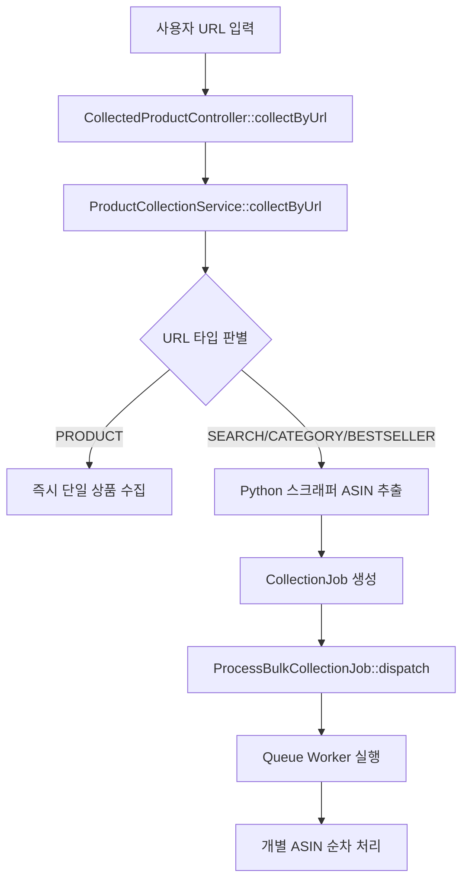

# URL 수집 기능 사양서 (URL_COLLECTION.md)

## 📋 개요

**EctoKorea URL 수집 기능**은 Amazon 검색 결과, 베스트셀러, 카테고리 페이지 등의 URL을 직접 입력하여 해당 페이지의 모든 상품을 자동으로 수집하는 기능입니다.

## 🎯 지원 URL 타입

### ✅ 현재 지원 타입

#### 1. PRODUCT (단일 상품)
- **URL 형태**: `https://www.amazon.co.jp/dp/{ASIN}`
- **처리 방식**: 즉시 단일 상품 수집
- **예시**: `https://www.amazon.co.jp/dp/B0DJNXJTJL`

#### 2. SEARCH (검색 결과)
- **URL 형태**: `https://www.amazon.co.jp/s?k={keyword}`
- **처리 방식**: Python 스크래퍼로 ASIN 추출 → Queue Job 처리
- **예시**: `https://www.amazon.co.jp/s?k=게임+컨트롤러`

#### 3. CATEGORY (카테고리 페이지)  
- **URL 형태**: `https://www.amazon.co.jp/gp/browse.html?node={categoryId}`
- **처리 방식**: Python 스크래퍼로 ASIN 추출 → Queue Job 처리
- **예시**: `https://www.amazon.co.jp/gp/browse.html?node=637394`

#### 4. BESTSELLER (베스트셀러)
- **URL 형태**: `https://www.amazon.co.jp/gp/bestsellers/{category}`
- **처리 방식**: Python 스크래퍼로 ASIN 추출 → Queue Job 처리  
- **예시**: `https://www.amazon.co.jp/gp/bestsellers/videogames/ref=zg_bs_nav_videogames_0`

## 🏗️ 아키텍처

### 처리 흐름



### 핵심 클래스

#### 1. CollectedProductController
```php
public function collectByUrl(Request $request): JsonResponse
{
    // URL 유효성 검증
    $validated = $request->validate([
        'url' => 'required|url',
        'auto_analyze' => 'boolean',
        'max_results' => 'integer|min:1|max:100'
    ]);

    // ProductCollectionService 호출
    $result = $this->collectionService->collectByUrl(...);

    // URL 수집 작업이 생성된 경우 Queue Job 디스패치
    if ($result['type'] === 'job' && isset($result['job'])) {
        ProcessBulkCollectionJob::dispatch($result['job']->id, auth('api')->id());
    }

    return response()->json([...]);
}
```

#### 2. ProductCollectionService
```php
public function collectByUrl(string $url, bool $autoAnalyze = true, int $maxResults = 20): array
{
    // URL 타입 감지
    $urlType = $this->detectUrlType($url);
    
    switch ($urlType) {
        case 'PRODUCT':
            // 단일 상품 즉시 처리
            return $this->handleSingleProduct($url, $autoAnalyze);
            
        case 'BESTSELLER':
            // ASIN 추출 → Queue Job 생성
            $asins = $this->extractBestsellerAsins($url, $maxResults);
            return $this->createUrlCollectionJob($url, $asins, $urlType, $autoAnalyze);
            
        // SEARCH, CATEGORY도 유사한 패턴
    }
}

private function extractBestsellerAsins(string $url, int $maxResults): array
{
    // Python 스크래퍼 API 호출
    $response = Http::timeout(30)->get($this->pythonScraperUrl . '/scrape/amazon/bestseller', [
        'url' => $url,
        'max_results' => $maxResults
    ]);
    
    // ASIN 배열 반환
    return $response->json('data.asins', []);
}
```

#### 3. ProcessBulkCollectionJob
```php
private function processUrlCollection(CollectionJob $job, ProductCollectionService $service): void
{
    $asins = $job->input_data['asins'] ?? [];
    $settings = $job->settings ?? [];
    
    foreach ($asins as $asin) {
        try {
            // 개별 ASIN 수집
            $service->collectByAsinForUser(
                $asin,
                $this->userId,
                $settings['auto_analyze'] ?? true,
                $settings['target_margin'] ?? 10.0,
                $settings['japan_shipping_jpy'] ?? 0,
                $settings['korea_shipping_krw'] ?? 0
            );
            
            $successCount++;
            
        } catch (Exception $e) {
            // 개별 실패 처리
            $errorCount++;
        }
        
        // 진행률 업데이트
        $job->update(['progress' => $processed, ...]);
        
        // API 호출 간격
        sleep(2);
    }
}
```

## 🔧 Python 스크래퍼 연동

### API 엔드포인트

#### 베스트셀러 ASIN 추출
```http
GET /ectokorea/api/v1/scrape/amazon/bestseller
?url=https://www.amazon.co.jp/gp/bestsellers/videogames
&max_results=20
```

**응답 형태:**
```json
{
    "success": true,
    "data": {
        "asins": ["B0DJNXJTJL", "B08H93ZRZ9", "B07VGRJDFY", ...],
        "url_type": "BESTSELLER",
        "found_count": 20,
        "processing_time": 1.2
    }
}
```

#### 검색 결과 ASIN 추출  
```http
GET /ectokorea/api/v1/scrape/amazon/search
?keyword=게임+컨트롤러
&max_results=50
```

#### 카테고리 ASIN 추출
```http  
GET /ectokorea/api/v1/scrape/amazon/category
?category_id=637394
&max_results=30
```

### 타임아웃 설정

- **ASIN 추출 전용**: 30초 타임아웃 (빠른 처리)
- **전체 상품 정보 수집**: 60초 타임아웃 (상세 정보)

```php
// ASIN만 추출 (빠름)
$response = Http::timeout(30)->get($url . '/bestseller', [...]);

// 전체 상품 정보 (느림, Queue 처리 권장)
$response = Http::timeout(60)->get($url . '/scrape', [...]);
```

## 📊 데이터 구조

### CollectionJob 입력 데이터

#### URL 타입 작업
```json
{
    "input_data": {
        "url": "https://www.amazon.co.jp/gp/bestsellers/videogames",
        "url_type": "BESTSELLER", 
        "asins": ["B0DJNXJTJL", "B08H93ZRZ9", "B07VGRJDFY"],
        "found_count": 20
    },
    "settings": {
        "auto_analyze": true,
        "max_results": 20,
        "target_margin": 10.0,
        "japan_shipping_jpy": 0,
        "korea_shipping_krw": 0
    }
}
```

### CollectionJob 결과 데이터
```json
{
    "results": [
        {
            "asin": "B0DJNXJTJL",
            "status": "success",
            "processed_at": "2025-09-05T08:30:15.000000Z"
        },
        {
            "asin": "B08H93ZRZ9", 
            "status": "error",
            "error": "Product not found",
            "processed_at": "2025-09-05T08:30:17.000000Z"
        }
    ]
}
```

## 🎯 사용자 인터페이스

### 프론트엔드 컴포넌트

#### ProductCollector.vue
```vue
<template>
  <div class="url-collection-section">
    <h3>URL 수집</h3>
    <form @submit.prevent="collectFromUrl">
      <input 
        v-model="urlForm.url"
        type="url" 
        placeholder="Amazon URL을 입력하세요"
        required
      />
      <input 
        v-model.number="urlForm.maxResults"
        type="number"
        min="1" 
        max="100"
        placeholder="최대 수집 개수 (기본: 20)"
      />
      <label>
        <input 
          v-model="urlForm.autoAnalyze"
          type="checkbox"
        />
        자동 수익성 분석
      </label>
      <button type="submit" :disabled="loading">
        {{ loading ? '수집 중...' : 'URL 수집 시작' }}
      </button>
    </form>
  </div>
</template>

<script setup>
import api from '../utils/api.js'

const collectFromUrl = async () => {
  try {
    loading.value = true
    
    const response = await api.post('/collected-products/collect/url', {
      url: urlForm.value.url,
      auto_analyze: urlForm.value.autoAnalyze,
      max_results: urlForm.value.maxResults || 20
    })
    
    if (response.data.success) {
      // 성공 알림
      showSuccess(response.data.message)
      
      // 작업 모니터링 페이지로 이동
      if (response.data.data.type === 'job') {
        router.push(`/collection-jobs/${response.data.data.job.id}`)
      }
    }
  } catch (error) {
    showError('URL 수집에 실패했습니다: ' + error.response?.data?.error)
  } finally {
    loading.value = false
  }
}
</script>
```

### 지원 URL 안내

#### 사용자 가이드
```
✅ 지원하는 URL 형태:

1. 단일 상품: https://www.amazon.co.jp/dp/B0DJNXJTJL
2. 검색 결과: https://www.amazon.co.jp/s?k=키워드  
3. 카테고리: https://www.amazon.co.jp/gp/browse.html?node=637394
4. 베스트셀러: https://www.amazon.co.jp/gp/bestsellers/videogames

⚠️ 주의사항:
- 최대 수집 개수: 100개
- 처리 시간: 1개당 약 2-3초
- 대량 수집은 백그라운드에서 처리됩니다
```

## 🚨 에러 처리 및 검증

### URL 유효성 검증

#### 1. 기본 URL 검증
```php
$validated = $request->validate([
    'url' => [
        'required',
        'url',
        'regex:/^https:\/\/www\.amazon\.co\.jp\/.*$/'  // Amazon Japan만 허용
    ],
    'max_results' => 'integer|min:1|max:100'
]);
```

#### 2. URL 타입 감지
```php
private function detectUrlType(string $url): string
{
    if (preg_match('/\/dp\/([A-Z0-9]{10})/', $url, $matches)) {
        return 'PRODUCT';
    }
    
    if (strpos($url, '/gp/bestsellers/') !== false) {
        return 'BESTSELLER';
    }
    
    if (strpos($url, '/s?') !== false) {
        return 'SEARCH';  
    }
    
    if (strpos($url, '/gp/browse.html') !== false) {
        return 'CATEGORY';
    }
    
    throw new InvalidArgumentException('지원하지 않는 URL 형태입니다.');
}
```

### 일반적인 에러 상황

#### 1. Python 스크래퍼 타임아웃
```php
try {
    $response = Http::timeout(30)->get($url);
} catch (ConnectionTimeout $e) {
    throw new Exception('페이지 로딩 시간이 초과되었습니다. 잠시 후 다시 시도해주세요.');
}
```

#### 2. ASIN 추출 실패
```php
$asins = $response->json('data.asins', []);

if (empty($asins)) {
    throw new Exception('해당 페이지에서 상품을 찾을 수 없습니다. URL을 확인해주세요.');
}
```

#### 3. Queue Job 디스패치 실패
```php
if ($result['type'] === 'job' && isset($result['job'])) {
    try {
        ProcessBulkCollectionJob::dispatch($result['job']->id, auth('api')->id());
    } catch (Exception $e) {
        Log::error('Queue job dispatch failed', ['job_id' => $result['job']->id]);
        throw new Exception('작업 처리 중 오류가 발생했습니다.');
    }
}
```

## 📈 성능 및 제한사항

### 처리 성능
- **ASIN 추출 속도**: 평균 1-2초 (20개 기준)
- **개별 상품 수집**: 평균 2-3초 (API 호출 간격 포함)
- **최대 동시 처리**: 100개 상품
- **권장 배치 크기**: 20-50개 (안정성 고려)

### 시스템 제한사항
- **URL 당 최대 수집**: 100개 상품
- **동시 실행 작업**: 사용자당 5개
- **API 호출 간격**: 2초 (서버 부하 방지)
- **타임아웃**: ASIN 추출 30초, 전체 처리 5분

### 권장사항
- **소량 테스트**: 처음에는 10-20개로 시작
- **네트워크 상태 확인**: WiFi 안정성 중요
- **피크 시간 회피**: 일본 시간 오후 시간대 회피 권장
- **정기적 모니터링**: Queue 상태 주기적 확인

## 🔮 향후 개선 계획

### 기능 확장
- **다중 페이지 지원**: 검색 결과 2-3 페이지까지 확장
- **필터링 옵션**: 가격대, 평점별 필터링  
- **자동 번역**: 상품명/설명 한국어 번역
- **중복 제거**: 이미 수집된 상품 자동 스킵

### 성능 최적화  
- **병렬 처리**: 다중 스레드 ASIN 처리
- **캐시 시스템**: 최근 수집 결과 캐싱
- **스마트 재시도**: 네트워크 오류 시 지능형 재시도

### 사용성 개선
- **진행률 실시간 표시**: WebSocket 기반 실시간 업데이트
- **예상 완료 시간**: 남은 처리 시간 표시
- **일괄 작업 관리**: 여러 URL 동시 처리

---

*이 문서는 EctoKorea v1.0 기준으로 작성되었습니다. (2025-09-05 업데이트)*